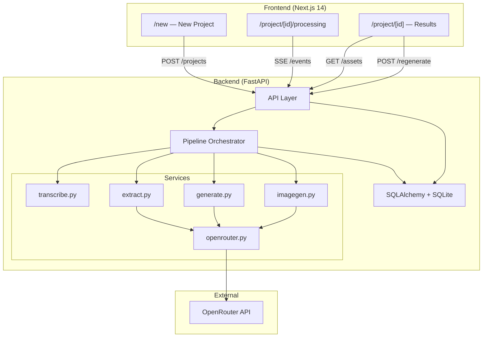

# AI Content Repurposing Engine — Implementation Plan

## Overview

Build a full-stack app that takes long-form content (YouTube URL, uploaded video/audio, or pasted text) and repurposes it into a blog post, Twitter/X thread, LinkedIn post, clip suggestions, and AI-generated thumbnails. The system uses **OpenRouter** as the single LLM/image provider, with a free-model fallback chain for most calls and a pinned paid model for the critic/rewrite pass.

> [!IMPORTANT]
> The spec mandates a strict build order (Section 10). This plan follows that sequence exactly. We will **not** jump ahead to frontend polish before the pipeline works end-to-end.

---

## User Review Required

> [!WARNING]
> **OpenRouter API Key**: You will need a valid `OPENROUTER_API_KEY` set in `backend/.env` for the pipeline to work. Even for free models, the key is required for authentication.

> [!IMPORTANT]
> **Critic Model Choice**: The spec requires a pinned paid model for Step 4.5 (critic/rewrite pass). The default will be `anthropic/claude-haiku-4.5` via the `CRITIC_MODEL` env var. If you have a preferred model, let me know.

> [!IMPORTANT]
> **MVP Scope Decision**: The spec offers an MVP cut (Section 11): pasted-text only, blog+thread+linkedin only (no clips/thumbnails), Auto mode only. I plan to build the **full spec**, but I'll build in the MVP-first order so the app is demoable at each checkpoint. Should I instead stop at the MVP cut?

---

## Open Questions

1. **Port allocation**: I'll default to backend on `:8000` and frontend on `:3000`. Any conflicts?
2. **Python version**: The spec calls for Python 3.11. I'll use whatever `python3` is available on your system. Acceptable?
3. **Node version**: Next.js 14 needs Node 18+. I'll use your system's Node. Acceptable?

---

## Proposed Changes

The build follows the spec's Section 10 order precisely. Each phase below maps to one numbered step in that sequence.

---

### Phase 1 — Backend Skeleton

**Goal**: FastAPI app boots, DB tables created, `/health` returns 200.

#### [NEW] [main.py](file:///home/yogesh/workspace/ai_atomizer/backend/app/main.py)
- FastAPI app with CORS middleware (allow `localhost:3000`)
- Lifespan handler to create DB tables on startup
- `/health` endpoint
- Include API routers

#### [NEW] [db.py](file:///home/yogesh/workspace/ai_atomizer/backend/app/db.py)
- SQLAlchemy async engine from `DATABASE_URL` env var (default `sqlite+aiosqlite:///./app.db`)
- `AsyncSession` factory
- `get_db` dependency for FastAPI

#### [NEW] [models.py](file:///home/yogesh/workspace/ai_atomizer/backend/app/models.py)
- SQLAlchemy ORM models matching Section 4 exactly:
  - `Project` (id, title, source_type, source_ref, status, default_model_mode, default_pinned_model, created_at)
  - `Transcript` (id, project_id, full_text, segments JSON)
  - `Highlight` (id, project_id, start_seconds, end_seconds, quote, reason)
  - `GeneratedAsset` (id, project_id, asset_type, content, related_highlight_id, model_used, status, created_at)
  - `Job` (id, project_id, stage, status, error_message, model_used, updated_at)

#### [NEW] [schemas.py](file:///home/yogesh/workspace/ai_atomizer/backend/app/schemas.py)
- Pydantic models for request/response serialization for all endpoints

#### [NEW] [requirements.txt](file:///home/yogesh/workspace/ai_atomizer/backend/requirements.txt)
- `fastapi`, `uvicorn[standard]`, `sqlalchemy`, `aiosqlite`, `python-dotenv`, `pydantic`, `httpx`, `yt-dlp`, `faster-whisper`, `python-multipart`

#### [NEW] [.env](file:///home/yogesh/workspace/ai_atomizer/backend/.env)
- Template with all env vars from Section 9

---

### Phase 2 — OpenRouter Service (`services/openrouter.py`)

**Goal**: Prove the riskiest integration in isolation — fetch free models, send a request with `models` array, read back `model_used`.

#### [NEW] [openrouter.py](file:///home/yogesh/workspace/ai_atomizer/backend/app/services/openrouter.py)
- **`get_free_models()`**: Call `GET https://openrouter.ai/api/v1/models`, filter for models where `pricing.prompt == "0"` and `pricing.completion == "0"`, return ordered list of slugs. Cache for 1 hour (in-memory with TTL).
- **`get_all_models()`**: Return full model list from `/api/v1/models` for the model selector UI. Also cached.
- **`chat_completion(messages, system_prompt, model_mode, pinned_model, response_format)`**:
  - If `model_mode == "auto"`: set `models` array to the free model list
  - If `model_mode == "pinned"`: set `model` to the pinned slug
  - POST to `https://openrouter.ai/api/v1/chat/completions`
  - Extract and return `response.choices[0].message.content` + `response.model` (the actual model that served the request)
- **`generate_image(prompt, model_slug)`**:
  - POST to `/chat/completions` with `modalities: ["image", "text"]` and an image-capable model
  - Return base64 image data + `model_used`
- All functions use `httpx.AsyncClient` with proper error handling and retries
- **Every response** logs and returns `model_used`

---

### Phase 3 — Text Ingestion (`POST /projects` for `article_text`)

**Goal**: Accept pasted text, create a Project, and store it. No audio yet.

#### [NEW] [projects.py](file:///home/yogesh/workspace/ai_atomizer/backend/app/api/projects.py)
- `POST /projects`: Accept `{source_type, source_ref, title, default_model_mode, default_pinned_model}`. For `article_text`, store the text as `source_ref`. Create Project row with `status=pending`. Kick off pipeline via `BackgroundTasks`. Return `{project_id}`.
- `GET /projects/{id}`: Return project status + metadata
- `GET /projects/{id}/transcript`: Return transcript
- `GET /projects/{id}/highlights`: Return highlights
- `GET /projects/{id}/events`: SSE endpoint (stubbed initially, wired in Phase 8)

#### [NEW] [assets.py](file:///home/yogesh/workspace/ai_atomizer/backend/app/api/assets.py)
- `GET /projects/{id}/assets`: List all generated assets
- `GET /projects/{id}/assets/{asset_id}`: Single asset detail
- `POST /projects/{id}/assets/{asset_id}/regenerate`: Regenerate with optional `{model: "slug"}`

#### [NEW] [pipeline.py](file:///home/yogesh/workspace/ai_atomizer/backend/app/pipeline.py)
- `run_pipeline(project_id)`: Orchestrates Steps 1–6
- For `article_text`: skip Steps 1–2, use pasted text as transcript
- Creates `Job` rows for each stage, updates status as it progresses
- On failure, sets `Project.status = failed` with error message

---

### Phase 4 — YouTube/Upload Ingestion + Transcription

**Goal**: Download audio from YouTube URLs, accept file uploads, transcribe with `faster-whisper`.

#### [NEW] [transcribe.py](file:///home/yogesh/workspace/ai_atomizer/backend/app/services/transcribe.py)
- **`transcribe_audio(audio_path)`**: Run `faster-whisper` (model `base` for speed), produce segments with `{start_seconds, end_seconds, text}`. Concatenate into `full_text`. Store on `Transcript` row.
- Falls back to OpenAI Whisper API if `WHISPER_MODE=api`

#### [MODIFY] [pipeline.py](file:///home/yogesh/workspace/ai_atomizer/backend/app/pipeline.py)
- Step 1: For `youtube_url`, use `yt-dlp` to download audio-only (smallest format) into `/uploads/{project_id}/`
- Step 1: For `upload`, file is already saved to `/uploads/{project_id}/`
- Step 2: Call `transcribe_audio()` on the audio file

#### [MODIFY] [projects.py](file:///home/yogesh/workspace/ai_atomizer/backend/app/api/projects.py)
- Handle `upload` source type: accept multipart file upload, save to `UPLOAD_DIR/{project_id}/`

---

### Phase 5 — Highlight Extraction (Step 3)

**Goal**: Structured JSON extraction from transcript with retry on parse failure.

#### [NEW] [extract.py](file:///home/yogesh/workspace/ai_atomizer/backend/app/services/extract.py)
- **`extract_highlights(transcript_text, segments, model_mode, pinned_model)`**:
  - Build the system prompt from Section 5, Step 3
  - Call `openrouter.chat_completion()` with `response_format` hint
  - Parse response against Pydantic schema: `{highlights: [{start_seconds, end_seconds, quote, reason}]}`
  - On parse failure, retry once with a correction prompt
  - Store `Highlight` rows
  - For `article_text` (no timestamps): set `start_seconds=0, end_seconds=0`

---

### Phase 6 — Content Generation + Critic Pass (Steps 4, 4.5)

**Goal**: Generate blog, thread, linkedin drafts in parallel. Then run critic/rewrite with pinned paid model.

#### [NEW] [generate.py](file:///home/yogesh/workspace/ai_atomizer/backend/app/services/generate.py)
- **`generate_blog(transcript, highlights, model_mode, pinned_model)`**: Uses blog prompt from spec
- **`generate_thread(transcript, highlights, model_mode, pinned_model)`**: Uses Twitter/X thread prompt
- **`generate_linkedin(transcript, highlights, model_mode, pinned_model)`**: Uses LinkedIn prompt
- **`generate_clip_captions(highlight, model_mode, pinned_model)`**: For each Highlight, generate caption + on-screen text
- **`critic_rewrite(draft, transcript, asset_type)`**: ALWAYS uses `CRITIC_MODEL` env var (paid model, never free chain). Prompt: "Rewrite this, cutting any sentence that could apply to literally any topic, and any claim not actually said in the source transcript."
- All calls go through `openrouter.chat_completion()`
- Each function stores `GeneratedAsset` row with `model_used`

#### [MODIFY] [pipeline.py](file:///home/yogesh/workspace/ai_atomizer/backend/app/pipeline.py)
- Step 4: Run blog, thread, linkedin generation in parallel (`asyncio.gather`)
- Step 4: Also generate clip captions for each highlight
- Step 4.5: Run critic/rewrite on each draft (blog, thread, linkedin, clip captions)

---

### Phase 7 — Image Generation (Step 5)

**Goal**: Generate thumbnails via OpenRouter image generation.

#### [NEW] [imagegen.py](file:///home/yogesh/workspace/ai_atomizer/backend/app/services/imagegen.py)
- **`generate_thumbnail(context_text, project_id, asset_label)`**:
  1. First LLM call: ask for a concrete visual description (not the raw quote)
  2. Second call: `openrouter.generate_image()` with the description
  3. Save base64 result as PNG to `/generated/{project_id}/{asset_label}.png`
  4. Store `GeneratedAsset` with `asset_type=thumbnail`, content = file path, `model_used`

#### [MODIFY] [pipeline.py](file:///home/yogesh/workspace/ai_atomizer/backend/app/pipeline.py)
- Step 5: Generate one thumbnail for the blog post, one per clip highlight
- Step 6: Set `Project.status = done` once all assets are in terminal state

---

### Phase 8 — SSE Progress + Models Proxy

**Goal**: Real-time pipeline progress via Server-Sent Events, and a `/models` proxy for the frontend model selector.

#### [MODIFY] [projects.py](file:///home/yogesh/workspace/ai_atomizer/backend/app/api/projects.py)
- `GET /projects/{id}/events`: SSE stream. On each `Job` status change, emit an event with `{stage, status, model_used, error_message}`. Use an in-memory event queue per project (asyncio.Queue or similar).

#### [NEW] [models_api.py](file:///home/yogesh/workspace/ai_atomizer/backend/app/api/models_api.py)
- `GET /models`: Proxy `openrouter.get_all_models()`, return formatted list with `{id, name, pricing, is_free}` for frontend consumption.

#### [NEW] Event broadcast system
- Add a simple in-memory pub/sub per project_id using `asyncio.Queue`
- Pipeline stages publish events; SSE endpoint subscribes

---

### Phase 9 — Frontend Scaffold

**Goal**: Next.js 14 + Tailwind + Framer Motion installed. Aceternity UI components copied in.

#### Next.js project setup
- `npx -y create-next-app@latest ./` with App Router, TypeScript strict, Tailwind CSS, ESLint
- Install: `framer-motion clsx tailwind-merge`
- The `motion` package (Framer Motion's lightweight export) comes with `framer-motion`

#### [NEW] [lib/utils.ts](file:///home/yogesh/workspace/ai_atomizer/frontend/lib/utils.ts)
- `cn()` utility using `clsx` + `tailwind-merge`

#### [NEW] [lib/api.ts](file:///home/yogesh/workspace/ai_atomizer/frontend/lib/api.ts)
- Typed fetch wrappers for all backend endpoints
- `createProject()`, `getProject()`, `getAssets()`, `regenerateAsset()`, `getModels()`, `subscribeToEvents()`

#### Aceternity UI Components (copied into [components/ui/](file:///home/yogesh/workspace/ai_atomizer/frontend/components/ui/))
Components needed per the spec:
| Component | Used On | Purpose |
|---|---|---|
| **Tabs** | `/new` | Switch input modes |
| **Hover Border Gradient** | `/new` | Submit button accent |
| **Multi Step Loader** | `/processing` | Pipeline progress |
| **Background Beams** | `/processing` | Subtle background |
| **Bento Grid** | `/project/[id]` | Results layout — signature moment |
| **Focus Cards / 3D Card** | `/project/[id]` | Hover effect in grid |
| **Text Generate Effect** | `/project/[id]` | First-load text reveal |
| **Moving Border** | Asset detail | Copy button |

---

### Phase 10 — Frontend Pages

**Goal**: Wire all three pages to the backend API.

#### [NEW] [app/new/page.tsx](file:///home/yogesh/workspace/ai_atomizer/frontend/app/new/page.tsx)
- **Tabs**: YouTube URL / Upload file / Paste text
- **Dropzone** component for file upload mode
- **Model Selector**: Auto (free, fastest) / Pin a model dropdown
- **Submit button** with Hover Border Gradient effect
- Dark theme, premium typography (Inter/Outfit from Google Fonts)

#### [NEW] [app/project/\[id\]/processing/page.tsx](file:///home/yogesh/workspace/ai_atomizer/frontend/app/project/[id]/processing/page.tsx)
- **Multi Step Loader** mapped to pipeline stages
- Subscribes to `GET /projects/{id}/events` SSE stream
- **Background Beams** behind the loader (quiet, not the main moment)
- Auto-redirects to results dashboard when pipeline completes

#### [NEW] [app/project/\[id\]/page.tsx](file:///home/yogesh/workspace/ai_atomizer/frontend/app/project/[id]/page.tsx)
- **Bento Grid** layout — one cell per asset type (blog / thread / linkedin / clips / thumbnails)
- **Focus Cards** hover effect within grid cells
- **Text Generate Effect** on first content load
- **model_used badge** on each card (understated, informational)
- Click into any cell → expands to full asset detail view

#### [NEW] [components/dropzone.tsx](file:///home/yogesh/workspace/ai_atomizer/frontend/components/dropzone.tsx)
- Animated drag-and-drop with file type validation

#### [NEW] [components/model-selector.tsx](file:///home/yogesh/workspace/ai_atomizer/frontend/components/model-selector.tsx)
- Two-mode control: Auto / Pin a model
- Dropdown populated from `GET /models`

#### [NEW] [components/bento-results-grid.tsx](file:///home/yogesh/workspace/ai_atomizer/frontend/components/bento-results-grid.tsx)
- Bento grid layout with asset cards
- Responsive: 2-col on mobile, 4-col on desktop

---

### Phase 11 — Regenerate, Copy/Export, Error States

**Goal**: Polish the interaction layer.

#### Asset detail enhancements
- **Moving Border "Copy" button**: Copies content to clipboard
- **Plain export action**: Download as `.md` / `.txt`
- **"Regenerate with different model"**: Opens pin-a-model dropdown, calls `POST /regenerate`
- **Error states**: Failed assets show retry button, error message from Job

#### Global error handling
- Toast notifications for API errors
- Graceful degradation if SSE connection drops (poll fallback)

---

## Architecture Diagram



---

## Verification Plan

### Automated Tests
```bash
# Backend health check
curl http://localhost:8000/health

# Create a text-only project and verify pipeline
curl -X POST http://localhost:8000/projects \
  -H "Content-Type: application/json" \
  -d '{"source_type": "article_text", "source_ref": "Test content...", "title": "Test"}'

# Check project status
curl http://localhost:8000/projects/1

# List generated assets
curl http://localhost:8000/projects/1/assets
```

### Manual Verification
1. Submit pasted text → verify all 3 content types generated + model_used logged
2. Submit YouTube URL → verify transcription + highlight extraction + content generation
3. Test regenerate with pinned model → verify different model_used
4. Verify SSE stream updates processing page in real-time
5. Verify Bento Grid layout renders all assets correctly
6. Test copy/export actions
7. Test error states (invalid URL, API key missing)

---

## File Tree Summary

```
ai_atomizer/
├── backend/
│   ├── app/
│   │   ├── main.py
│   │   ├── db.py
│   │   ├── models.py
│   │   ├── schemas.py
│   │   ├── pipeline.py
│   │   ├── api/
│   │   │   ├── projects.py
│   │   │   ├── assets.py
│   │   │   └── models_api.py
│   │   └── services/
│   │       ├── openrouter.py
│   │       ├── transcribe.py
│   │       ├── extract.py
│   │       ├── generate.py
│   │       └── imagegen.py
│   ├── requirements.txt
│   └── .env
├── frontend/
│   ├── app/
│   │   ├── layout.tsx
│   │   ├── page.tsx              # redirect to /new
│   │   ├── globals.css
│   │   ├── new/page.tsx
│   │   └── project/[id]/
│   │       ├── page.tsx
│   │       └── processing/page.tsx
│   ├── components/
│   │   ├── ui/                   # Aceternity components
│   │   │   ├── tabs.tsx
│   │   │   ├── hover-border-gradient.tsx
│   │   │   ├── multi-step-loader.tsx
│   │   │   ├── background-beams.tsx
│   │   │   ├── bento-grid.tsx
│   │   │   ├── focus-cards.tsx
│   │   │   ├── text-generate-effect.tsx
│   │   │   └── moving-border.tsx
│   │   ├── dropzone.tsx
│   │   ├── bento-results-grid.tsx
│   │   └── model-selector.tsx
│   ├── lib/
│   │   ├── utils.ts
│   │   └── api.ts
│   ├── package.json
│   └── tailwind.config.ts
└── README.md
```
